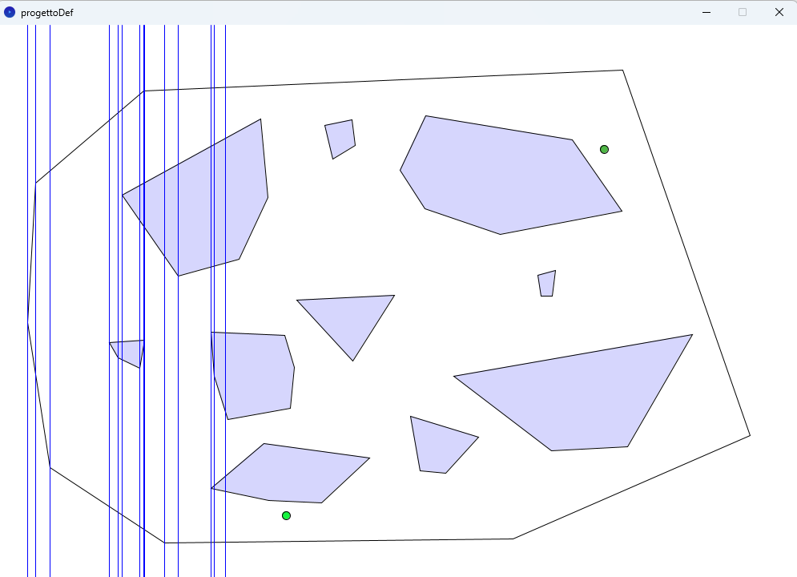

# Path_planning_RoboticaIndustriale

## Descrizione
Questo progetto implementa un sistema di pianificazione del percorso per un robot mobile in un ambiente bidimensionale definito da poligoni.

L’utente può costruire interattivamente l’ambiente di lavoro, inserire ostacoli e calcolare un percorso tra un punto iniziale e un punto finale, evitando le collisioni. Il percorso finale viene successivamente interpolato tramite B-spline per ottenere una traiettoria più fluida.

## Obiettivi del progetto
- Modellare un ambiente poligonale con ostacoli interni
- Garantire la validità geometrica delle configurazioni: l'ambiente deve essere convesso, gli ostacoli possono avere qualunque forma.
- Calcolare un percorso sicuro tra due punti
- Generare una traiettoria liscia tramite interpolazione

## Funzionalità

- Creazione di un poligono esterno convesso che rappresenta l’ambiente
- Inserimento di ostacoli poligonali interni con vincoli:
  - nessuna sovrapposizione tra ostacoli
  - ostacoli contenuti nell’ambiente
- Selezione di:
  - punto iniziale
  - punto finale
- Decomposizione dello spazio tramite sweep line verticale
- Costruzione del grafo di connettività
- Calcolo del cammino minimo tramite algoritmo Dijkstra
- Interpolazione della traiettoria con:
  - B-spline di grado 3
  - B-spline di grado 4

## Controlli

- `b` → avvia la costruzione della sweep line verticale  
- `a` → visualizza le vere celle
- 'd' → calcola i punti di intersezione
- `f` → genera e visualizza il grafo di navigazione  
- 'g' → visualizza i nodi che vengono utilizzati per il cammino
- 'c' → visualizza il cammino minimo
- 'v' → avvia il percorso tramite spline
- 'q' → avvia la spline di grado superiore
- 'h' → visualizza finestra di help

## Risultati

Il sistema consente la visualizzazione di:
- ambiente e ostacoli poligonali
- decomposizione in celle
- grafo di navigazione
- percorso minimo tra i punti selezionati
- traiettoria finale interpolata

##  Limitazioni

- Il sistema opera in uno spazio bidimensionale
- L'ambiente deve essere un poligono convesso
- La qualità del percorso dipende dalla decomposizione dello spazio
- L’interpolazione spline può richiedere correzioni in presenza di collisioni

## Autore
Simonetta Ricci

##  Note

Progetto individuale sviluppato nell’ambito di attività accademiche relative alla pianificazione del moto e ai sistemi di controllo per l'esame di Robotica Industriale.
